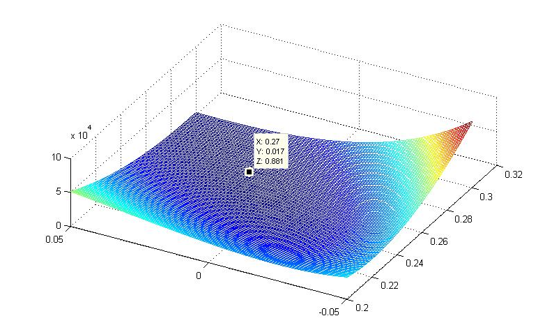

# 方案三

## 售价调整

$$
z_{i}=(\frac{8657\times S_{i}^{0.017}}{q_{i}})^{3.704}\quad (i=1,2,3)
$$

$$
q_{i}=\frac{8657\times S_{i}^{0.017}}{z^{0.27}}\quad (i=1,2,3)
$$

得到前三套住房的售价波动范围

$$
11633\leq y1\leq 12375\\\
10577\leq y2\leq 10998\\\
11086\leq y3\leq 11646\\\
$$

## 模型建立
以最大投资回报率为目标函数，各房型套数x_i以及房型1.2.3的售价为决策变量建立整数规划。
### 目标函数

$$
\text{max}\; k=\frac{L}{C}
$$

### 约束条件

#### 容积率约束
$$
\frac{\sum_{i=1}^{8}S_{i}\times x_{i}}{102077.6}\leq 2.28
$$

#### 建房套数约束
$$
x_{i}min\leq x_{i}\leq x_{i}max\quad i=1,2,\ldots ,11
$$

其中$x_i$为整数。
#### 售价约束
$$
11633\leq y1\leq 12375\\\
10577\leq y2\leq 10998\\\
11086\leq y3\leq 11646\\\
y_i = q_i, \quad i = 4,5,6,\ldots, 11
$$
### 满意度约束
$$
z_i = \frac{\sum\limits_{i=1}^{11}r_ix_i}{\sum\limits_{i=1}^{11}x_i}\ge 0.706
$$

## 模型评估

### 方案核算
[方案核算](app2)

### 方案比较
|规划方案|	建房总套数|	总建筑面积|	容积率|	总收益|	前期成本|
|-------|-----------|-----------|-------|------|-----|
|方案Ⅱ|	1450|	221350|	1.989662766|	2814780000|	2115610000|
|方案Ⅲ|	1640|	250979|	2.4587|	3198900000|	2287240000|

|规划方案|	增值税|	净利润|	回报率|	满意度|	
|-------|------|-------|------|-----|
|方案Ⅱ|	97013000|	443130000|	20.95|	0.7068966	|
|方案Ⅲ|	147665000|	583260000|	25.50|	0.706	|
