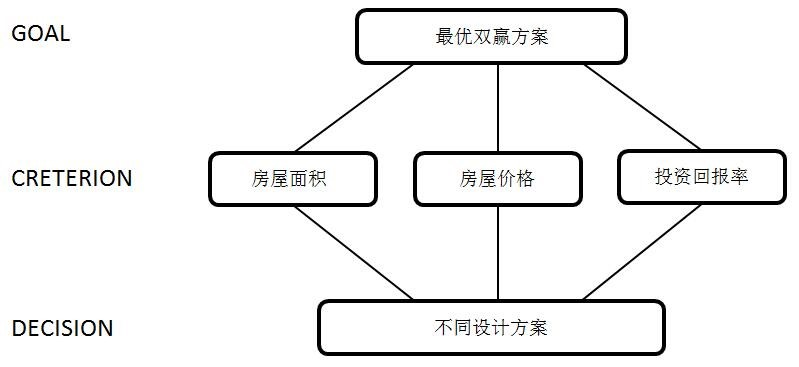

# 方案四

## 层次分析法

### 指标选取

#### 房屋面积指标
$$
\alpha_{i}=\frac{S_{i}-S_{min}}{S_{max}-S_{min}}
$$

$$
\alpha=\frac{\sum_{i=1}^{11}\alpha_{i}\times x_{i}}{\sum_{i=1}^{11}x_{i}}
$$

#### 房屋售价指标
$$
\beta_{i}=\frac{q_{max}-q_{i}}{q_{max}-q_{min}}
$$
$$
\beta=\frac{\sum_{i=1}^{11}\beta_{i}\times x_{i}}{\sum_{i=1}^{11}x_{i}}
$$

#### 投资回报率指标
$$
R=\frac{ROI-25\%}{25\%}
$$

### 确定权重
最后的目标函数为$z=a\alpha+ b\beta + c R$,赋予总房屋面积指标$\alpha$的相对权重为1，总房屋售价指标$\beta$的相对权重为3，投资回报率指标$R$的相对权重为2,，则

$$
(a, b, c) = (\frac 16, \frac 36, \frac 26)
$$

## 模型建立

### 目标函数

$$
max\; z=\frac 16\alpha+ \frac 36\beta + \frac 26 R
$$

### 约束条件

#### 容积率约束
$$
\frac{\sum_{i=1}^{8}S_{i}\times x_{i}}{102077.6}\leq 2.28
$$

#### 建房套数约束
$$
\frac{\sum_{i=1}^{8}S_{i}\times x_{i}}{102077.6}\leq 2.28
$$

其中，$x_i $为非负整数。

#### 售价约束
$$
11633\leq y1\leq 12375\\\
10577\leq y2\leq 10998\\\
11086\leq y3\leq 11646\\\
y_i = q_i, \quad i = 4,5,6,\ldots, 11
$$

#### 平均满意度约束

$$
z_i = \frac{\sum\limits_{i=1}^{11}r_ix_i}{\sum\limits_{i=1}^{11}x_i}\ge 0.706
$$

## 模型求解

| |房型1	|房型2|	房型3|	房型4|	房型5|	    房型6	|
|-------|-------|----|------|------|------|-----|
|房型售价|	11633|	10998|	11086|	12800|	12800|	13600|	
建房套数|	50|	50|	50|	150|	291|	349|

||房型7|	房型8|	房型9|	房型10|	房型11|
|------|-------|----|------|------|------|-----|
|房型售价|	14000|	10400|	6400|	6800	|7200|
|建房套数|450	|100|	50|	50|	50|

## 方案核算

[方案核算](http://112.74.43.59:3838/app1)
