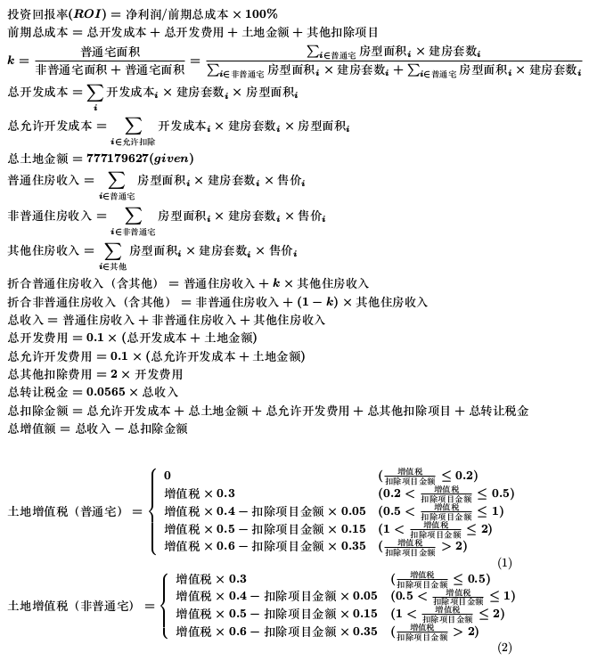

# 核算

## 理论

## 可视化工具

### 单房型核算

根据房型的基本信息，给出售价和数目，计算单一房型的成本、收益等信息。

[Web App (single)](http://112.74.43.59:3838/app2)

### 方案核算

根据某种准则，确定出各房型的面积和数目，计算得到该方案的成本与收益、容积率和增值税等信息。

[Web App (complex)](http://112.74.43.59:3838/app1)
